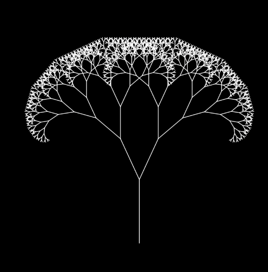

#  **Part 1: Imaging Technique Inspiration**

## 1. **Idenyify an image**
I choose to use fractal trees as inspiration for my homework. 

## 2. **A 100 words discussing**
- I find the technique of recursive patterns in a fractal canopy particularly inspiring for my quiz.

- I want to learn from the example: a step-by-step generation of complexity, recursion method, showing the complexity and harmonious beauty in nature.

- Given the quiz requirements, I think this is a beneficial technique.
Because this project meets the aesthetic requirements of computer vision design, the picture is complex but harmonious, with both potential order and complex abstract elements.

## 3. **2 high-quality screenshots**

#  **Part 2: Coding Technique Exploration**

## 1. **Find a coding technique**
[Link Text](https://github.com/drgsl/Render-Engines/blob/04ee6a4af01a377050b77621ed5fa0d07229f88e/desmos/p5.js/fractal-tree/README.md)

## 2. **a 100 words discussing**
- 1.setup():
  - The setup() function initializes the canvas size and creates two sliders: one to control the rotation Angle and the other to control the scale factor.
- 2.draw():
  - Set the background, get the current value of the slider, angle and shrink represent the Angle and scale of the branch, respectively.
- 3.branch(len):
  - The origin is moved to the center of the canvas, and then branch(100) is called to start drawing the branch, with an initial length of 100 pixels.
  - In the branch(len) function, after drawing the current branch, recursively calls itself to draw the left and right branches, with the original len * shrink length, until the branch length is 4 pixels or less.
- In sum:
  - In this way, users can adjust the shape of the tree in real time and observe the effects of different angles and scaling factors on the tree.

## 3. **draw inspiration from what parts**
- Geometry aesthetic feeling

- Generative art

- Symmetry

- Simplicity and complexity

## 4. **Provide an image or screenshot showcasing the coding technique in action, along with a link to an example implementation (including a link to some example code).**
screenshots:

link:
[Link Text](https://github.com/drgsl/Render-Engines/blob/04ee6a4af01a377050b77621ed5fa0d07229f88e/desmos/p5.js/fractal-tree/sketch.js)

###### IDEA 9103 | unikey:yxia0276